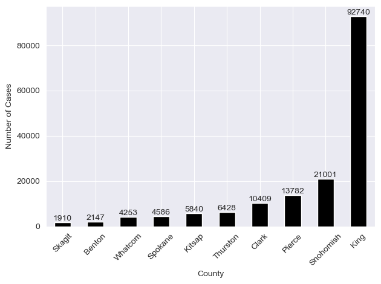
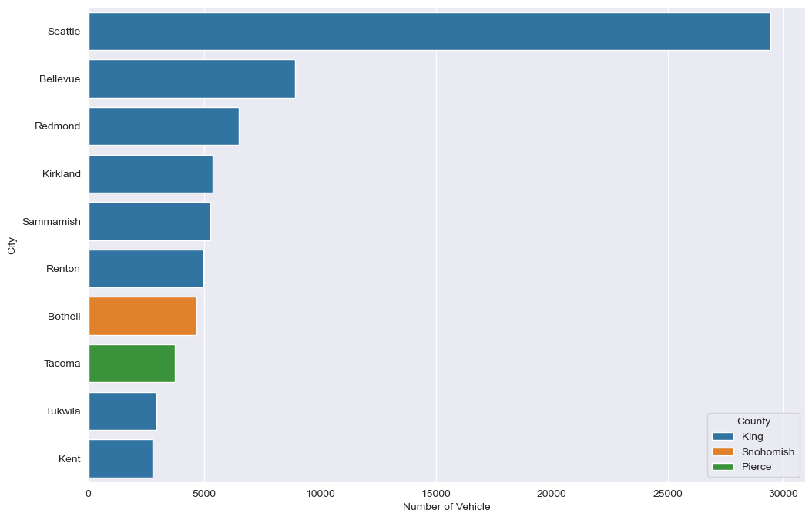
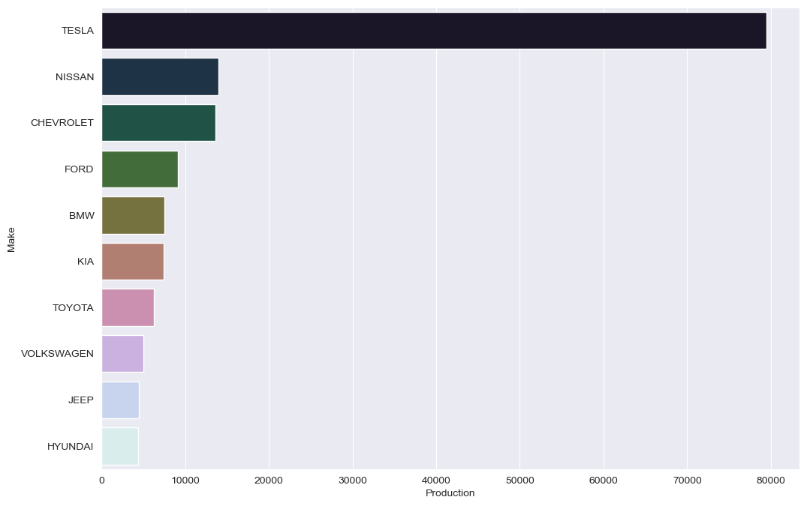
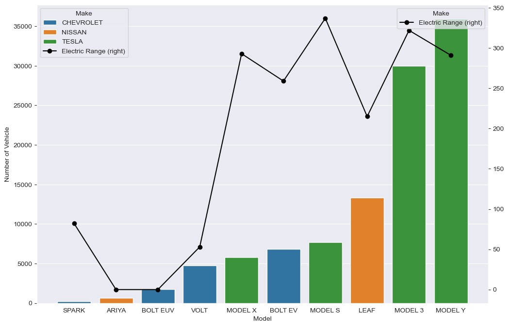
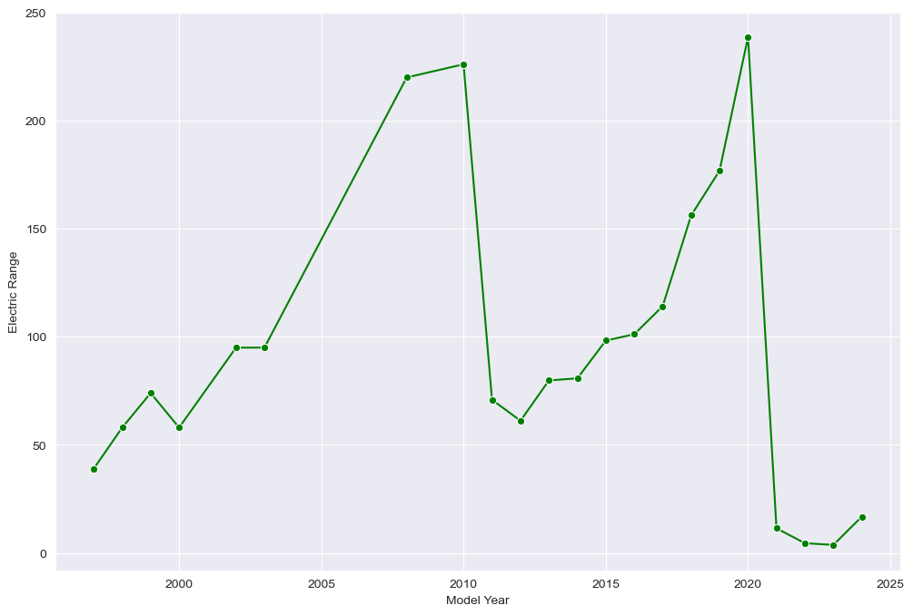
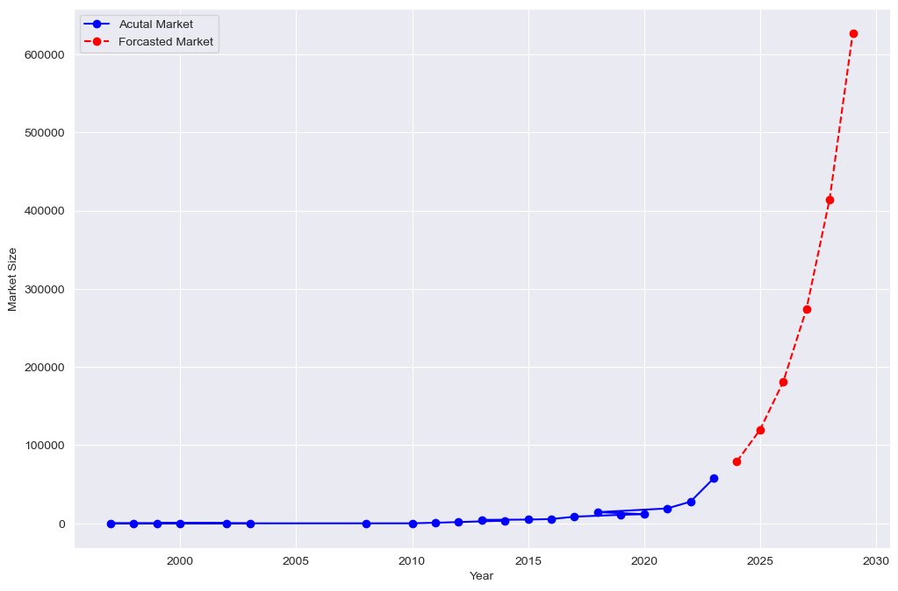

# Market Size of EVs: Case Study

Market Size Analysis is the process of estimating the potential sales for a product or service within a particular market segment. In the context of electric vehicles (EVs), it involves assessing the total volume of EV registrations to understand the growth of the market, forecast future trends, and help stakeholders make informed decisions regarding production, infrastructure development, and policy-making.

## Dataset:

- **VIN (1-10):** Partial Vehicle Identification Number.
- **County:** The county in which the vehicle is registered.
- **City:** The city in which the vehicle is registered.
- **State:** The state in which the vehicle is registered. It appears that this dataset may be focused on Washington (WA) state.
- **Postal Code:** The postal code where the vehicle is registered.
- **Model Year:** The year of the vehicle model.
- **Make:** The manufacturer of the vehicle.
- **Model:** The model of the vehicle.
- **Electric Vehicle Type:** The type of electric vehicle, e.g., Battery Electric Vehicle (BEV).
- **Clean Alternative Fuel Vehicle (CAFV) Eligibility:** Eligibility status for clean alternative fuel vehicle programs.
- **Electric Range:** The maximum range of the vehicle on a single charge (in miles).
- **Base MSRP:** The Manufacturer’s Suggested Retail Price.
- **Legislative District:** The legislative district where the vehicle is registered.
- **DOL Vehicle ID:** Department of Licensing Vehicle Identification.
- **Vehicle Location:** Geographic coordinates of the vehicle location.
- **Electric Utility:** The electric utility service provider for the vehicle’s location.
- **2020 Census Tract:** The census tract for the vehicle’s location.

## Problem Statement:
- Define whether the analysis is global, regional, or focused on specific countries.
- Gather information from industry associations, market research firms (e.g., BloombergNEF, IEA), and government publications relevant to the EV market.
- Use historical data to identify trends in EV sales, production, and market.
- Analyze the market size and growth rates for different EV segments.
- Based on the market size analysis, provide strategic recommendations for businesses looking to enter or expand in the EV market.

## Focus:
- **EV Adoption Over Time:** Analyze the growth of the EV population by model year.
- **Geographical Distribution:** Understand where EVs are most commonly registered (e.g., by county or city).
- **EV Types:** Breakdown of the dataset by electric vehicle type (BEV, etc.).
- **Make and Model Popularity:** Identify the most popular makes and models among the registered EVs.
- **Electric Range Analysis:** Analyze the electric range of vehicles to see how EV technology is progressing.
- **Estimated Growth in Market Size:** Analyze and find the estimated growth in the market size of electric vehicles.

## Screenshots

From the above bar chart, it’s clear that EV adoption has been increasing over time, especially noting a significant upward trend starting around 2016. The number of vehicles registered grows modestly up until that point and then begins to rise more rapidly from 2017 onwards. The year 2023 shows a particularly sharp increase in the number of registered EVs, with the bar for 2023 being the highest on the graph, indicating a peak in EV adoption.

Seattle, which is in King County, has the highest number of EV registrations by a significant margin, far outpacing the other cities listed.
Bellevue and Redmond, also in King County, follow Seattle with the next highest registrations, though these are considerably less than Seattle’s.
Cities in Snohomish County, such as Kirkland and Sammamish, show moderate EV registrations.

TESLA leads by a substantial margin with the highest number of vehicles registered.
NISSAN is the second most popular manufacturer, followed by CHEVROLET, though both have significantly fewer registrations than TESLA.
FORD, BMW, KIA, TOYOTA, VOLKSWAGEN, JEEP, and HYUNDAI follow in decreasing order of the number of registered vehicles.

Higer selling cars typically have high range, but if a car has higher range and sells less then maybe it is priced higher.

The forecasted EV registrations predict an even more dramatic increase in the near future, with the number of registrations expected to rise sharply in the coming years.
Given the growing trend in actual EV registrations and the projected acceleration as per the forecast data, we can conclude that the EV market size is expected to expand considerably. The steep increase in forecasted registrations suggests that consumer adoption of EVs is on the rise, and this trend is likely to continue. Overall, the data point towards a promising future for the EV industry, indicating a significant shift in consumer preferences and a
