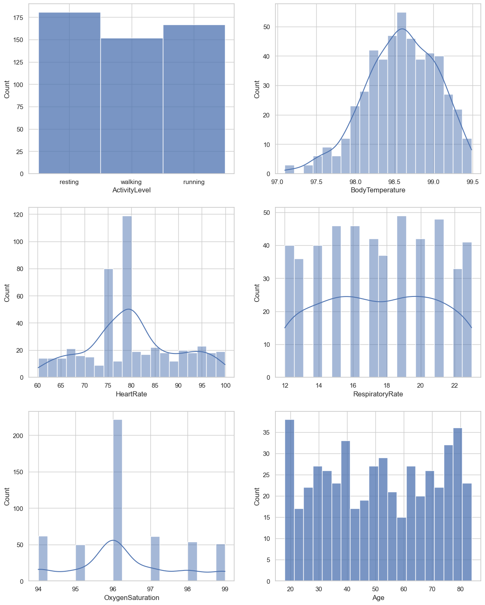
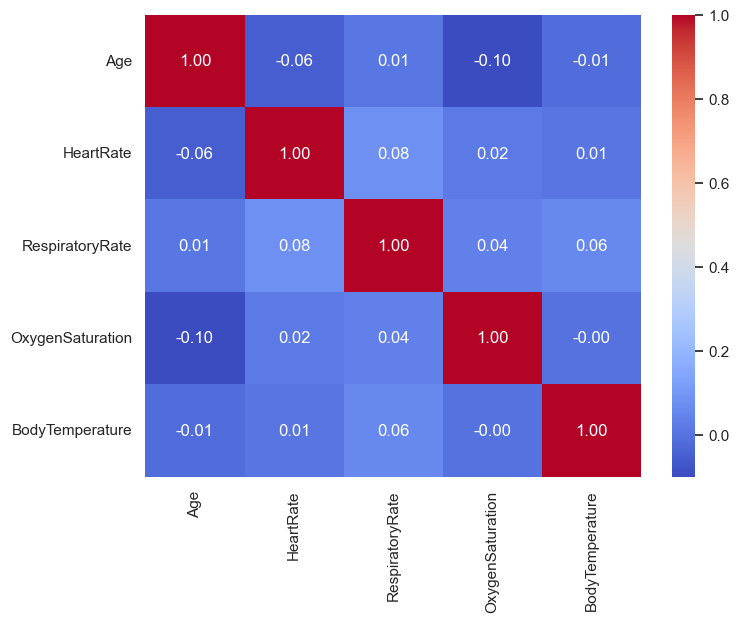
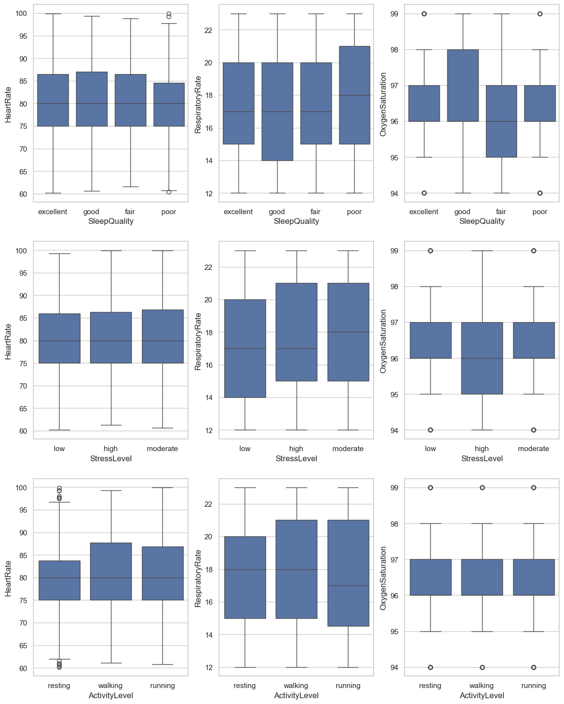

# Data Analysis Case Study - HealthCare Data

Dataset includes health metrics from 500 individuals, featuring variables such as age, gender, heart rate, blood pressure, respiratory rate, body temperature, and oxygen saturation, recorded over a specific period. These variables provide a comprehensive snapshot of each patient’s health status, which is crucial for monitoring and managing various health conditions.

## Problem Statement

Traditional health monitoring systems often categorize patient health status using rigid, predefined thresholds that may not capture the nuanced variations across a diverse patient population. This can lead to oversimplified assessments and potentially overlook subtle yet critical patterns in health data. The challenge is to develop a more dynamic and responsive approach that utilizes unsupervised learning to identify natural groupings within health data, facilitating personalized and precise health management.

## Expected Outcomes

- **Identified Clusters**: Distinct patient groups based on health metrics, each with unique characteristics that provide insight into their specific health needs.

- **Personalized Health Insights**: Enhanced understanding of patient health requirements and risks, enabling tailored intervention strategies.

- **Improved Health Monitoring**: Recommendations for targeted monitoring and intervention strategies that cater to the specific needs of each cluster, leading to more effective health management and better patient outcomes.

## Screenshots

The correlation matrix shows no strong correlations between the variables, as all the values are close to zero. Specifically, none of the health metrics (Age, Heart Rate, Respiratory Rate, Body Temperature, and Oxygen Saturation) display a strong positive or negative linear relationship with one another in this particular dataset. It suggests that, for this group of individuals, changes in one metric are not strongly associated with changes in the others.

Heart rate appears relatively consistent across different levels of sleep quality and stress, with a slight increase in variation for those reporting poor sleep. Oxygen saturation shows a minimal decrease in median values from excellent to poor sleep quality, with some outliers indicating lower saturation for excellent and good sleep. When correlated with stress levels, oxygen saturation remains largely unchanged. Overall, while there are outliers, the central tendencies suggest that neither heart rate nor oxygen saturation is greatly affected by sleep quality or stress level within this dataset.

