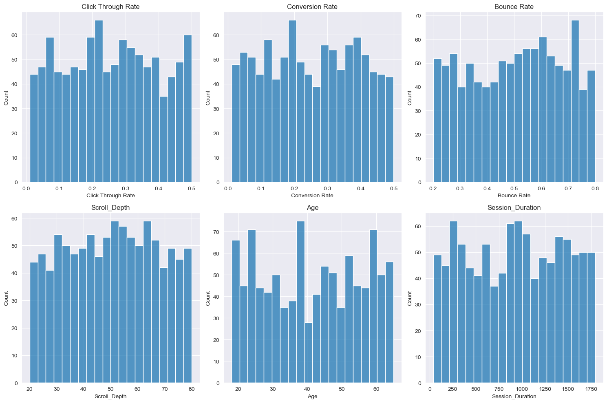
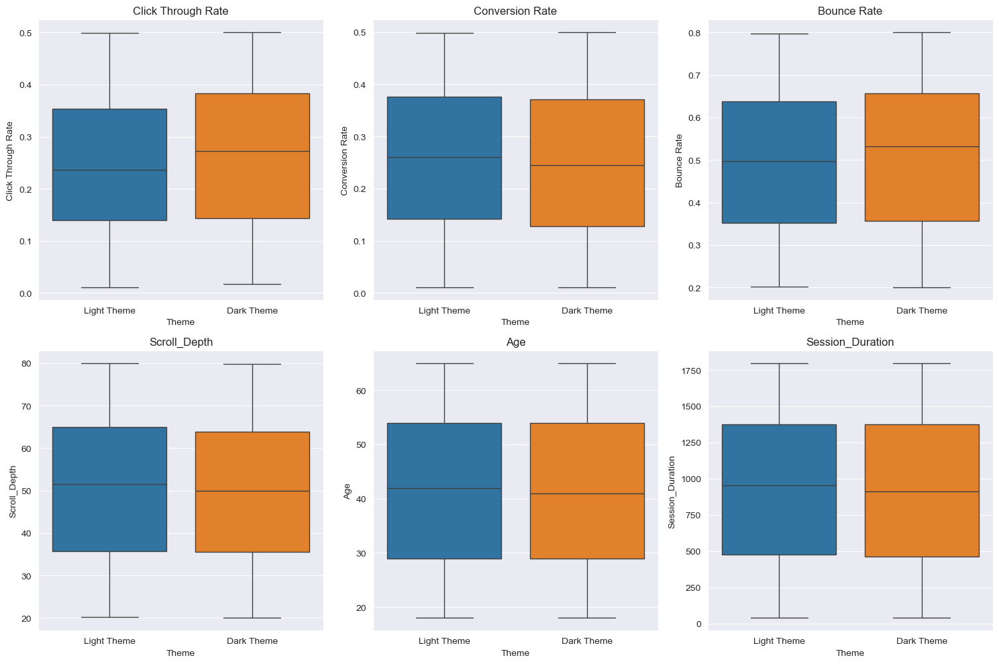

Here, I conduct hypothesis tests to determine if there exists a signifiacatn difference in 2 groups:
1. Light theme
2. Dark Theme

Findings:

1. P-value of 0.63 is alot greater than generally accepted alpha of 0.05.
So, we fail to reject null hypothesis.
##

