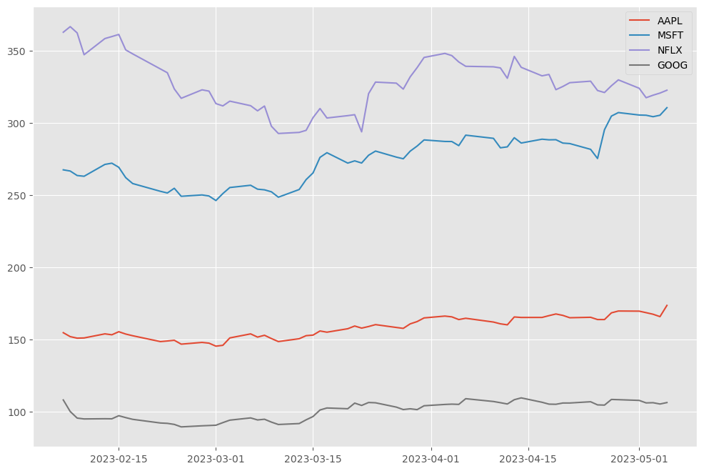
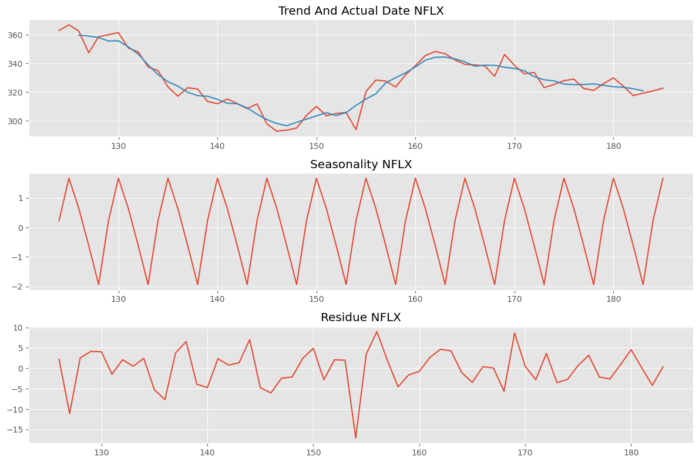
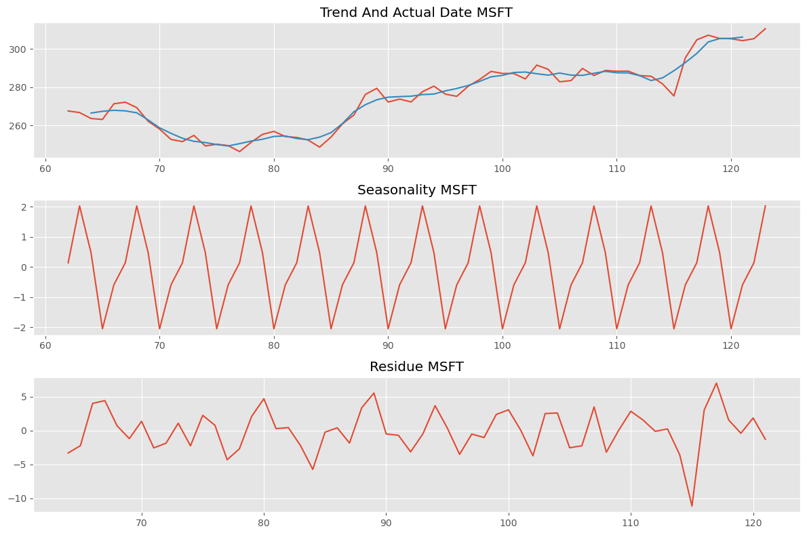
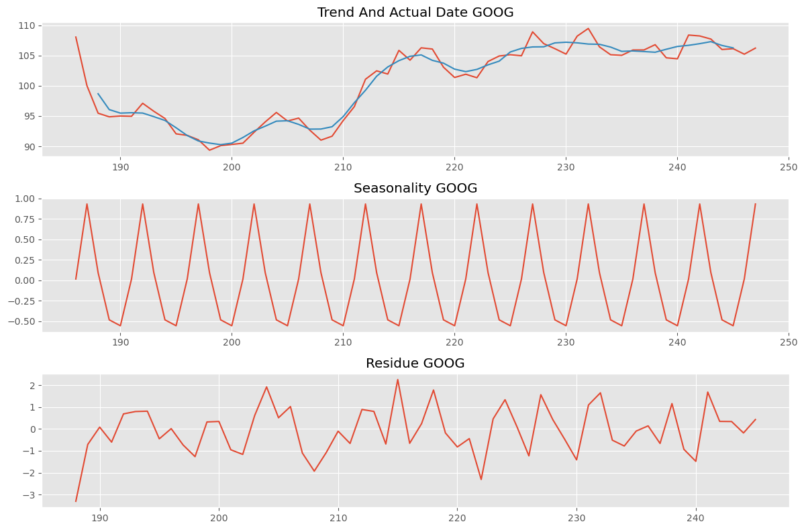
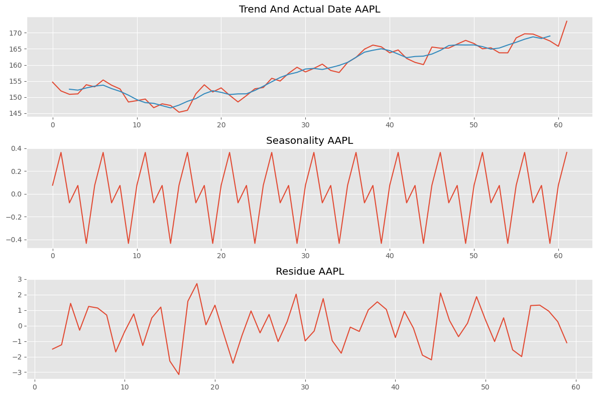

Time Series Forcasting of 4 Stocks

Key Components in Time Series Analysis:

Y-axis : Target Variable  
X-axis : Time 

1. Trend: Overall direction of y component over x time period
2. Seasonal component : Repeating pattern over a fixed time period, e.g 3 month, 6 months and 
usually have some relation to calender date.
3. Cyclical : Cyclic pattern with no fixed time period, can easily be confused with seasonal component.

## Screenshots

##

Very Strong Seasonal Components as seen from decomposition  