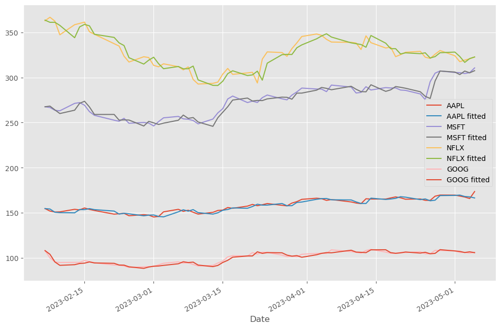
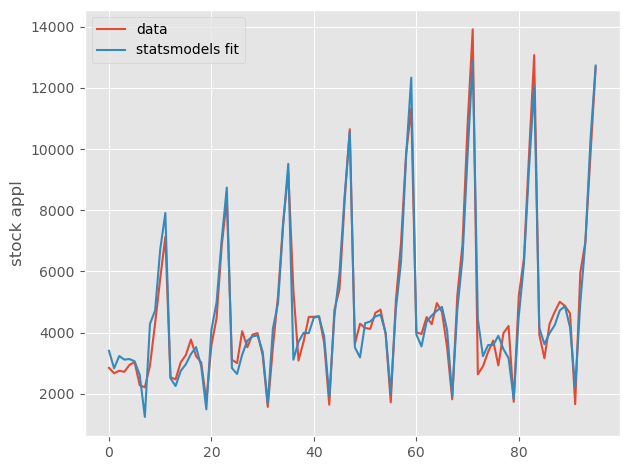
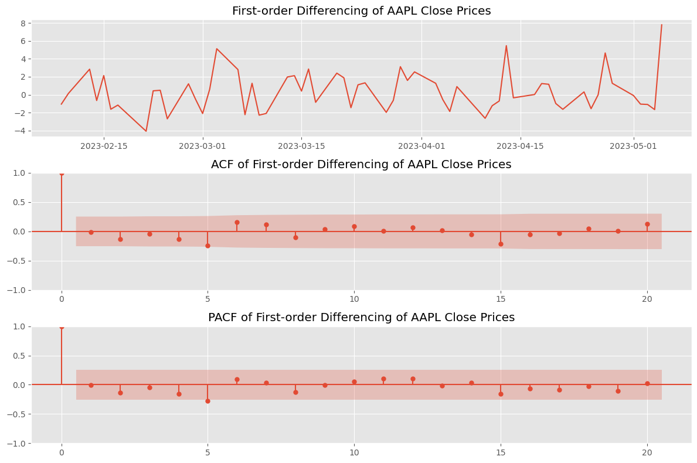

Time Series Forcasting of 4 Stocks

Key Components in Time Series Analysis:

Y-axis : Target Variable  
X-axis : Time 

1. Trend: Overall direction of y component over x time period
2. Seasonal component : Repeating pattern over a fixed time period, e.g 3 month, 6 months and 
usually have some relation to calender date.
3. Cyclical : Cyclic pattern with no fixed time period, can easily be confused with seasonal component.

ETS(Error-Trend-Seasonality) model work good with most data but are inheritly more simpler and fail to fit to complex data
and usually require testing multiple parameters before a good fit.

Error-Trend-Seasonality can all be additive(add) or multiplicatice(mul) depending upon the 
Time series.

Best to decompose a TS into Error-Trend-Seasonality for defining their nature.

## Screenshots

##

Very Strong Seasonal Components as seen from decomposition  

##
Simple ETS fitted on Stocks

Simple ETS fitted on Champaing data

## 
<h3><b>ARIMA</b></h3>

<h4>
ACF:
</h4> 
Auto Correlation Function. Pearsons correlation for X(t-1)->X(t).
Includes both direct correlation and indirect corellation.E.g. X(t-2)->X(t) = coeff(21)X(t-1) + coeff(22)X(t-2) + error.  
Here coeff(22) -> Direct effect of k=2 i.e PACF

<h4>
PACF:
</h4> 

Partial Auto Correlation Function. Direct effect of lag on 
time series.

First order ACF and PACF

Second order ACF and PACF

